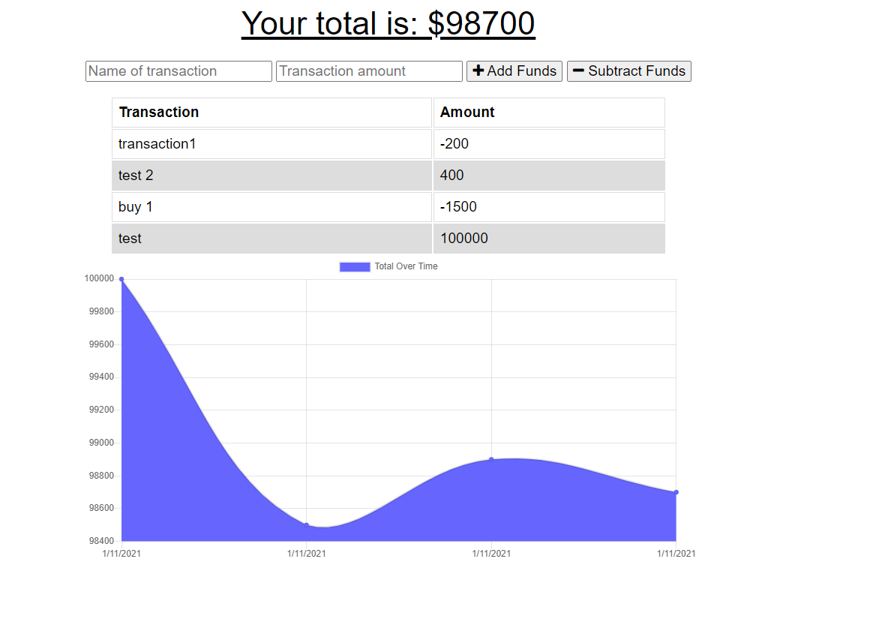

# BudgetTracker-PWA App

## Links
### [Live Site]( https://sleepy-sands-17380.herokuapp.com/)
### [Repository](https://github.com/Terd47/BudgetTracker-PWA)
## Description
This app is a Progressive web application which helps the user track their expenses both online and offline and displays budget trends  with a simple but effective graph.

## User Story
AS AN avid traveller
I WANT to be able to track my withdrawals and deposits with or without a data/internet connection
SO THAT my account balance is accurate when I am traveling

## Installation 
N/A

## Technologies used
- HTML
- CSS
- Bootstrap
- JavaScript
- Express.js
- MongoDB
- MongoDB Atlas
- Mongoose
- Morgan
- Node.js
- indexedDB
- PWA 
## ScreenShots

